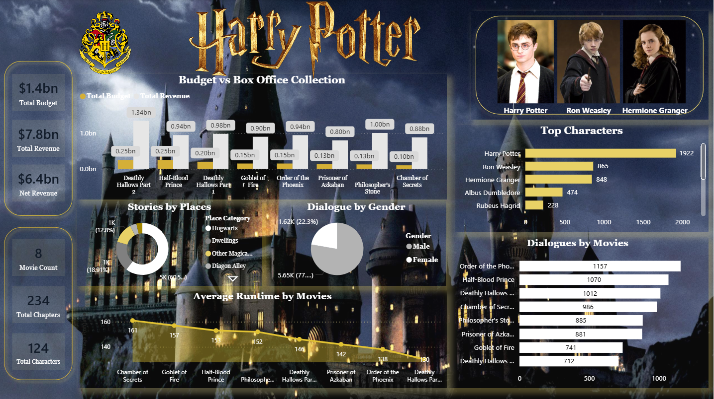

# 🧙‍♂️ Harry Potter Power BI Dashboard

An immersive and interactive Power BI dashboard analyzing the **Harry Potter movie universe**, built using the **Maven Magic Challenge dataset**.  
This project focuses on **storytelling through data**, combining analytics with strong visual design inspired by the Wizarding World.

---

## 🔮 Project Objective

The goal of this project is to:
- Analyze the Harry Potter movies from multiple perspectives (financials, characters, dialogues, runtime, and locations)
- Transform raw movie data into **insightful, visually compelling analytics**
- Demonstrate practical skills in **Power BI, DAX, data modeling, and dashboard design**

This project is created **purely for learning and portfolio purposes**.

---
## 🖼️ Dashboard Preview


---

## 📊 Dashboard Overview

The dashboard provides insights across the following areas:

### 💰 Financial Analysis
- **Total Budget, Revenue & Net Revenue**
- Budget vs Box Office Collection by Movie
- Comparison of profitability across all 8 movies

### 🧑‍🎤 Character Analytics
- Top Characters by Dialogue Count
- Dialogue distribution across major characters
- Gender-wise dialogue distribution

### 🗺️ Story & Location Analysis
- Stories by Magical Places (Hogwarts, Hogsmeade, Diagon Alley, etc.)
- Understanding where most storytelling happens in the wizarding world

### 🗣️ Dialogue Analysis
- Total dialogues by movie
- Dialogue contribution trends across the franchise

### ⏱️ Runtime Trends
- Average runtime by movie
- Runtime evolution across the series timeline

---

## 🧠 Key Insights

- **Harry Potter** dominates dialogue count across all characters
- Later movies show **higher box office performance** despite moderate budget increases
- Hogwarts is the most prominent storytelling location
- Male characters account for the majority of dialogues
- Movie runtimes gradually decline toward later installments

---

## 🛠️ Tools & Technologies Used

- **Power BI Desktop**
- **DAX** (CALCULATE, DISTINCTCOUNT, FILTER, ALL, measures)
- **Power Query** for data cleaning and transformation
- **Data Modeling** (fact & dimension tables)
- **Custom Visual Formatting**
- **Dashboard Design & Storytelling**

---

## 🧮 Key DAX Measures Used

```DAX
Total Budget = SUM ( Movies[Budget] )

Total Revenue = SUM ( Movies[Box Office] )

Net Revenue = [Total Revenue] - [Total Budget]

Total Movies = DISTINCTCOUNT ( Movies[Movie ID] )

Total Chapters = DISTINCTCOUNT ( Chapters[Chapter ID] )

Total Characters = DISTINCTCOUNT ( Characters[Character Name] )

Dialogue Count = COUNT ( Dialogue[Dialogue ID] )
```
---
## 📁 Dataset Information

**Source:** Maven Analytics – Maven Magic Challenge  

**Contents:**
- Movies  
- Chapters  
- Characters  
- Dialogues  
- Places  
- Spells  

⚠️ Dataset used strictly for **educational and portfolio purposes**.

---

## 📂 Project Structure

```text
Harry-Potter-PowerBI-Dashboard/
│
├── data/
│   ├── movies.csv
│   ├── chapters.csv
│   ├── characters.csv
│   ├── dialogues.csv
│   ├── places.csv
│   └── spells.csv
│
├── powerbi/
│   └── Harry_Potter_Dashboard.pbix
│
├── images/
│   └── dashboard_page_1.png
│   
└── README.md
```
---

## 🚀 What This Project Demonstrates

- Strong understanding of Power BI fundamentals  
- Ability to translate data into business & storytelling insights  
- Clean and structured data modeling  
- Advanced visual formatting & layout design  
- Portfolio-ready analytics project execution  

---

## 📌 Author

**Bhumika Gajbhiye**  
🎓 Master’s in Statistics  
📊 Aspiring Data Analyst / Business Analyst  
💡 Interests: Data Analytics, Visualization, Storytelling, Power BI  

---

## ⭐ Feedback & Suggestions

Feedback and suggestions are always welcome.  
If you like this project, feel free to ⭐ the repository.
